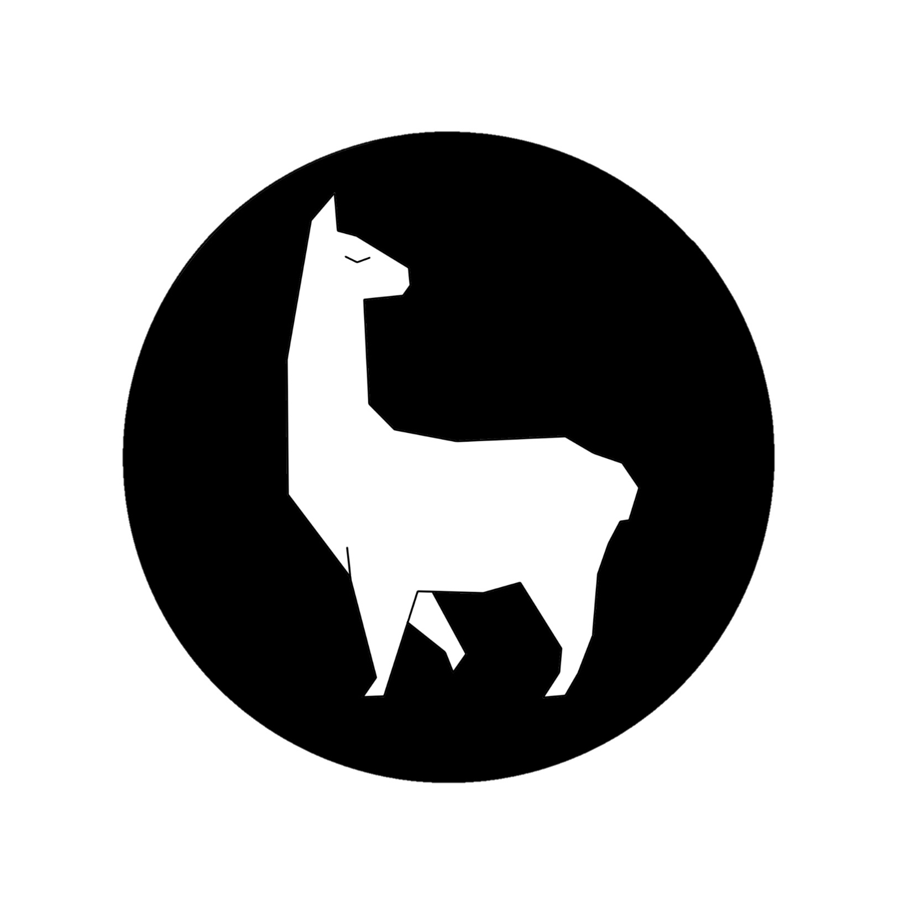

<h1 align="center">Alpaca</h1>

  

  <strong>Created by: Ikraam Agusta</strong>

## About Alpaca
  Alpaca, or Alpa/Alfa Path Academy, is an educational project aimed at educating young generations. Currently, this project is solely for my final year assignment in computer engineering, but I hope to continue developing it into a fully functional website.

  You might be wondering why a computer engineering student is creating such a complicated website for a final year project. I feel that if I graduate with only simple projects, I will have wasted the opportunity provided by the national government's tuition assistance program (KIP). That's why I decided to create this project instead.

  Initially, the purpose of this website was only to monitor an ESP32 device and provide study modules for elementary students at SD 1 Adzkia Padang. However, I came up with a more ambitious idea: why not create a complex website that includes e-learning features, a monitoring system, and a control system? This way, my final year project would not go to waste. And here it is.

  Thanks to documentation and assistance from ChatGPT and Deepseek AI (though sometimes the documentation wasn't very helpful), I didn’t have to start from scratch to build this project. I truly appreciate everyone who contributed to the documentation and trained the AI.

## Feature on Alpaca
  As mentioned earlier, the website includes an e-learning system with courses, modules, and content. It also features login functionality with email verification, as well as plugins and APIs for monitoring your children’s progress in studying the courses or interacting with the robots.

## Note
  This project is still under development, so please don’t judge it too harshly. Keep in mind that my major is computer engineering, not computer science.

## My Social Media Account
  <a href="https://web.facebook.com/profile.php?viewas=100000686899395&id=100012710521025" target="blank">Facebook</a>
  <a href="https://www.instagram.com/i_agusta/" target="blank">Instagram</a>
  <a href="mailto:Ikraamagusta90@gmail.com" target="blank">Email</a>